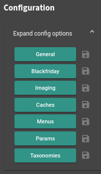
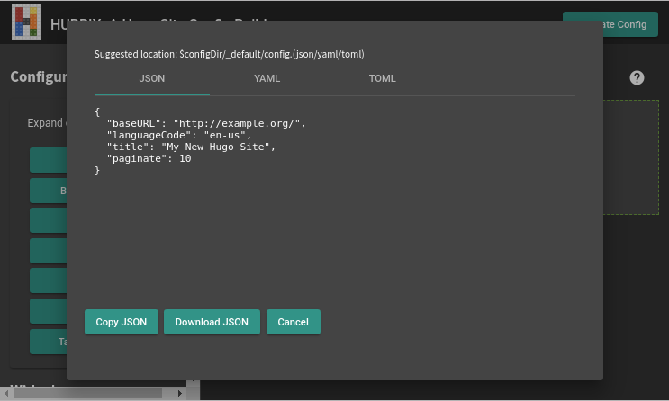
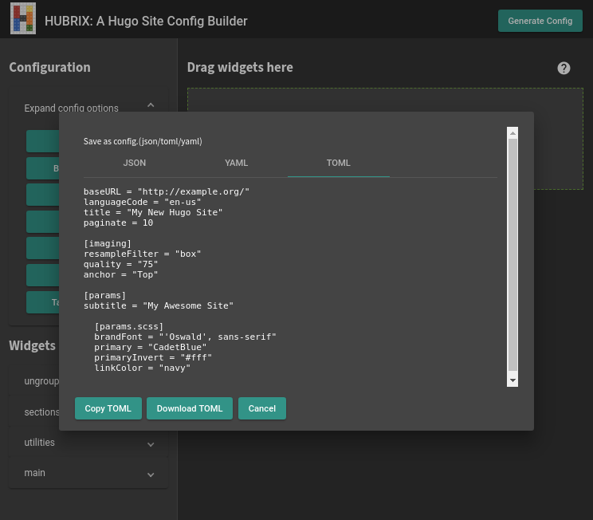
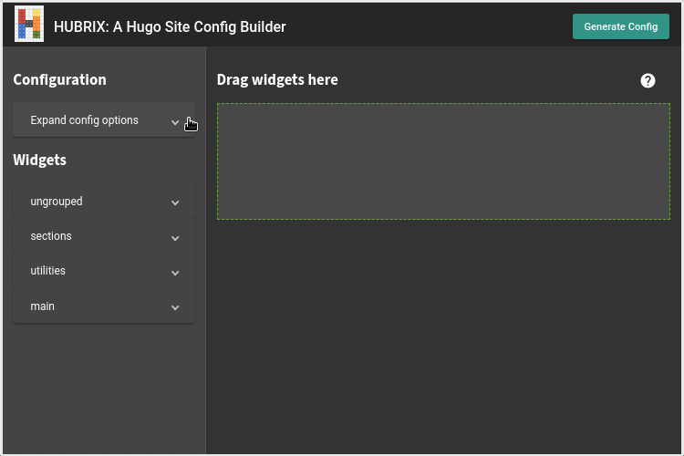

The configuration section of the sidebar contains the options to configure Hugo as well as theme-specific configurations. See below for the corresponding Hugo configuration documentation.

General
: https://gohugo.io/getting-started/configuration/#all-configuration-settings

Blackfriday
: https://gohugo.io/getting-started/configuration/#configure-blackfriday

Imaging
: https://gohugo.io/content-management/image-processing/#image-processing-config

Caches
: https://gohugo.io/getting-started/configuration/#configure-file-caches

Menus
: https://gohugo.io/content-management/menus/#add-non-content-entries-to-a-menu

Outputs
: https://gohugo.io/templates/output-formats/#configure-output-formats

Params
: These are the theme-specific configuration options

Taxonomies
: https://gohugo.io/content-management/taxonomies/#configuring-taxonomies

---

Clicking on a button brings up a modal dialog with its related options. Click Save once you are done.

The Save button to the right should become clickable. Clicking on this will bring up a modal with the `json(/toml/yaml)` config output.

You have the choice of either copying the config text to paste into your config files, or downloading them. It also suggests where to put the resulting file.

Note that this leverages a new feature introduced in Hugo 0.53, allowing users to save configuration in separate chunks. [Read the details about this feature here](https://gohugo.io/news/0.53-relnotes/).

You can, of course opt to generate only one config super-file. You can do this by clicking the **Generate Config** button on the upper right.

