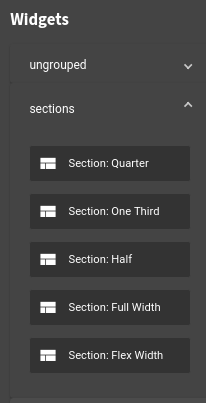
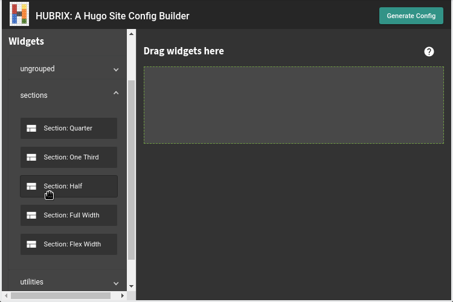
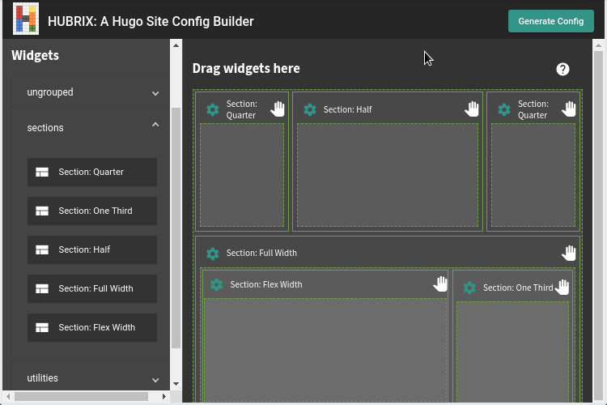
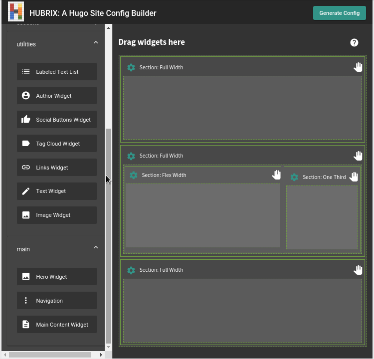

The widgets section contain draggable elements that you can use to configure how you want the site to look. 

There are two main element types:

### Containers

These are used to create the layout. Containers may contain other containers and widgets. These are grouped under **sections**.

You may optionally configure a container to have a class applied to it.

You may move containers around using the hand icon as handle. Dragging and dropping them outside the drag area removes them.

### Widgets

Once you are happy with the layout, you can add the widgets to the containers they need to go into.

You can configure the widgets by clicking on the settings (cog) icon