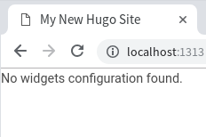
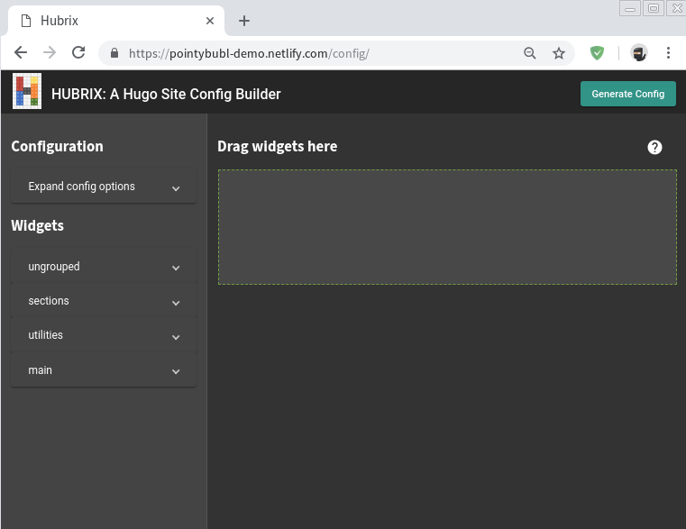
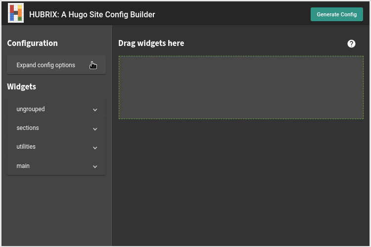

If you see the above message, congratulations! It means you have installed the theme correctly. Now we need to configure it.

Visit the demo site config page for drag-and-drop configuration: https://pointybubl-demo.netlify.com/config/

---

On the left is a sidebar with two sections. You can click on the sub-sections to expand them.

### Site Configuration 

[Read about configuring general site settings]()

### Widgets
[Read about the different widgets available]()